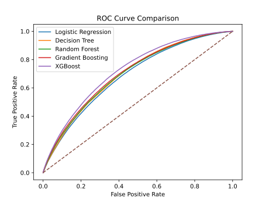
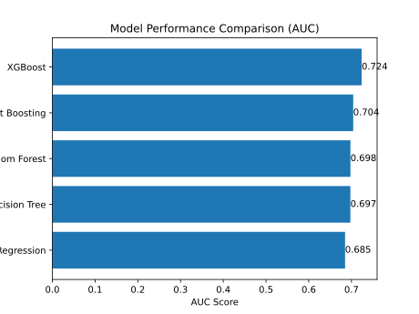

# Credit Risk Modelling Project

## 1. Executive Summary
Lending Club is a peer-to-peer lending platform. This project aims to predict the probability that a Lending Club loan becomes a bad loan using historical loan application and borrower risk features. The notebook compares multiple machine learning classifiers, including Logistic Regression, Decision Tree, Random Forest, Gradient Boosting, and XGBoost, to identify which approach separates risky loans from healthier ones most effectively.

XGBoost achieves the highest AUC among the evaluated models and therefore demonstrates the strongest ability to distinguish between good and bad loans. As a result, it could be integrated into the credit decision process to identify high-risk borrowers at an early stage. By improving the accuracy of default prediction, lenders can reduce expected credit losses, better manage risk exposure, and enhance overall profitability. 
## 2. Business Problem
Consumer lending platforms need to estimate default risk before issuing a loan. Poor risk assessment can lead to higher charge-offs, weaker portfolio quality, and reduced investor confidence.

The business goal of this project is to help distinguish higher-risk borrowers from lower-risk borrowers using historical Lending Club data. A reliable classifier can support:

- better approval or rejection decisions of received loan demands
- better pricing strategy
- improved monitoring of loan portfolio quality
- earlier identification of applicants likely to default

## 3. Methodology
The workflow in [Jupyter_notebook.ipynb] follows a straightforward supervised learning pipeline:

1. Create a binary target called `BadLoan` based on loan statuses associated with default, late payment, or charged off status
2. Select numeric risk features identified in the EDA phase (see [other project] (https://github.com/vdkellian/P2P-Loans-Data-Exploration)):
   - `loan_amnt`: Amount borrowed from Lending Club
   - `int_rate`: Loan interest rate 
   - `annual_inc`: Annual income at loan application date
   - `dti`: Debt-to-income ratio at loan application date
   - `fico_range_low`: FICO score at loan application date 
   - `installment`: Monthly loan installment amount
   - `revol_util`: Number of revolving accounts at application date
   - `total_acc`: Total number of accounts at application date
   - `open_acc`: Total number of opened credit lines at application date
3. Handle missing values using simple zero imputation
4. Split the data into train and test sets through stratification
5. Train and compare five classifiers:
   `Logistic Regression`, `Decision Tree`, `Random Forest`, `Gradient Boosting`, and `XGBoost`
6. Evaluate model performance using:
   `Accuracy`, `Precision`, `Recall`, `F1`, `ROC-AUC`, `PR-AUC`, confusion matrices

## 4. Skills
- Understanding of loan approval process
- binary classification for credit risk modeling
- data cleaning and feature selection
- train/test splitting with class stratification
- model comparison across linear, tree-based, ensemble, and boosting methods
- evaluation using both threshold-based and ranking-based metrics
- visualization of model quality through ROC, precision-recall, and confusion-matrix plots

## 5. Findings & Recommendations
The models produce the following ROC curve:

  
  

All models demonstrate satisfactory classification performance and predictive power, as their ROC curves lie significantly above the diagonal representing random guessing. Among the tested models, XGBoost achieves the highest AUC, indicating the strongest ability to distinguish between good and bad loans.

Such a model could be integrated into the loan approval process to identify high-risk borrowers at an early stage. By improving the accuracy of default prediction, lenders can make more informed decisions regarding loan approval, pricing, or risk mitigation strategies, ultimately reducing potential credit losses.

## 6. Next Steps
There are several strong ways to extend this project

- perform feature engineering with additional or transformed variables
- replace simple zero imputation with a more robust preprocessing pipeline
- address class imbalance with class weights or sampling techniques