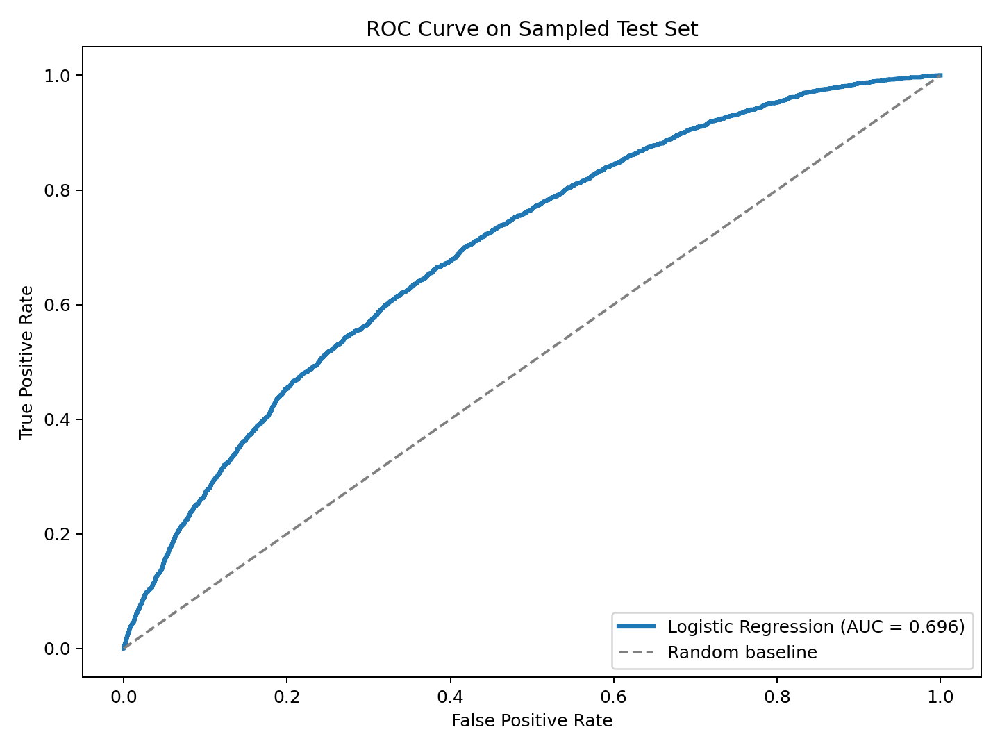

# Loan Default Probability Project

## 1. Executive Summary
This project predicts the probability that a Lending Club loan becomes a bad loan using historical loan application and borrower risk features. The notebook compares multiple machine learning classifiers, including Logistic Regression, Decision Tree, Random Forest, Gradient Boosting, and XGBoost, to identify which approach separates risky loans from healthier ones most effectively.

The project is designed as a practical credit risk workflow: define the default target, prepare numeric borrower features, train several classifiers, and evaluate them with both predictive quality metrics and efficiency plots. The final notebook includes visual comparisons such as ROC curves, precision-recall curves, confusion matrices, and runtime charts to make model performance easy to communicate.

## 2. Business Problem
Consumer lending platforms need to estimate default risk before issuing a loan. Poor risk assessment can lead to higher charge-offs, weaker portfolio quality, and reduced investor confidence.

The business goal of this project is to help distinguish higher-risk borrowers from lower-risk borrowers using historical Lending Club data. A reliable classifier can support:

- better approval or rejection decisions
- more risk-aware pricing
- improved monitoring of loan portfolio quality
- earlier identification of applicants likely to default

## 3. Methodology
The workflow in [Jupyter_notebook.ipynb] follows a straightforward supervised learning pipeline:

1. Load the Lending Club dataset
2. Create a binary target called `BadLoan` based on loan statuses associated with default or late payment
3. Select a focused set of numeric risk features:
   `loan_amnt`, `int_rate`, `annual_inc`, `dti`, `fico_range_low`, `fico_range_high`, `installment`, `revol_util`, `total_acc`, and `open_acc`.
4. Handle missing values using simple zero imputation.
5. Split the data into train and test sets with stratification.
6. Train and compare five classifiers:
   `Logistic Regression`, `Decision Tree`, `Random Forest`, `Gradient Boosting`, and `XGBoost`.
7. Evaluate model performance using:
   `Accuracy`, `Precision`, `Recall`, `F1`, `ROC-AUC`, `PR-AUC`, confusion matrices, training time, and prediction time.

## 4. Skills
This project demonstrates the following data science and machine learning skills:

- binary classification for credit risk modeling
- data cleaning and feature selection
- target engineering from business loan-status definitions
- train/test splitting with class stratification
- model comparison across linear, tree-based, ensemble, and boosting methods
- evaluation using both threshold-based and ranking-based metrics
- visualization of model quality through ROC, precision-recall, and confusion-matrix plots
- communication of model efficiency using training and prediction runtime charts

## 5. Findings & Recommendations
The notebook is structured to compare multiple classifiers side by side rather than rely on a single model. This is useful because credit risk problems often require balancing discrimination power, interpretability, and operational speed.

Based on the current workflow, the main recommendations are:

- use the model comparison table and plots in the notebook to choose the best classifier by `ROC-AUC` and `PR-AUC`, not accuracy alone
- pay close attention to `Recall` for the bad-loan class, because missing risky borrowers can be more costly than flagging extra safe borrowers
- review confusion matrices before deployment to understand the false-negative and false-positive tradeoff
- prefer simpler models such as Logistic Regression when interpretability is a priority, and stronger ensemble models when predictive performance is the main objective
- include both efficiency metrics and prediction metrics when presenting results, since a slightly better model may not be worth much higher runtime cost

## 6. Next Steps
There are several strong ways to extend this project:

- perform feature engineering with additional Lending Club variables
- replace simple zero imputation with a more robust preprocessing pipeline
- address class imbalance with class weights or resampling methods
- tune hyperparameters using cross-validation
- calibrate predicted probabilities for better risk scoring
- add feature importance or SHAP analysis for explainability
- save the best-performing final model and document a repeatable inference workflow
